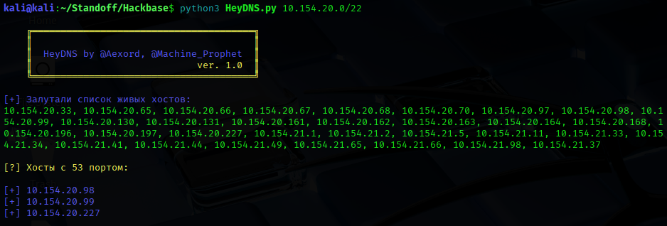
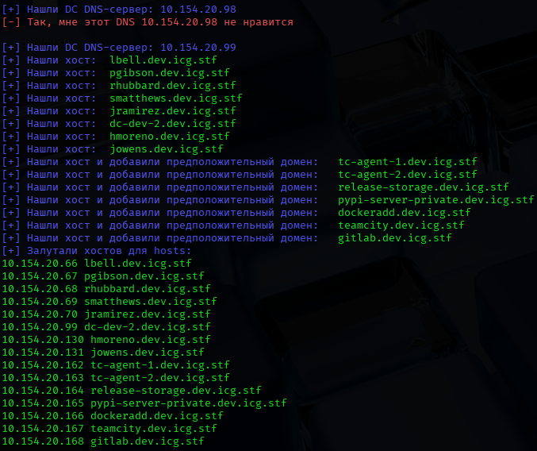
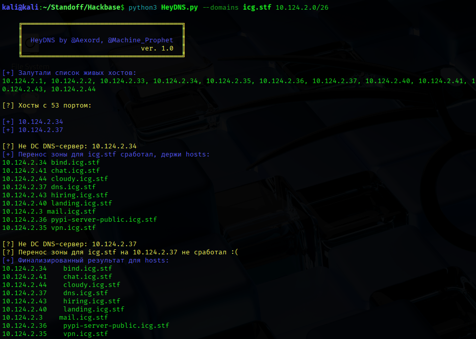
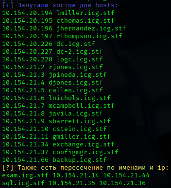
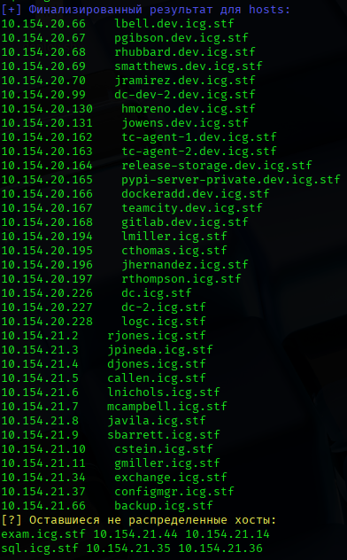

# HeyDNS
Утилита опроса DNS-серверов для идентификации хостов в подсети

### Эксплуатация на примере площадки Standoff365

Возьмём сегмент ICG и запроксируемся через машину из которой видны несколько DC.
Запустим программу для поиска хостов во внутреннем периметре:
```bash
python3 HeyDNS.py 10.154.20.0/22
```

Для начала определяются все живые хосты (с учетом реальной видимости из атакущего хоста!) и среди них ищутся хосты с DNS-сервером:
<br>

<br>
Далее в зависимости от того, является ли этот хост домен-контроллером или нет, осуществляется попытка переноса зоны (для этого необходимо предоставить через параметр `--domains` домен/домены) или банальный опрос всех IP входящих в подсеть у DC-DNS сервера:
<br>


<br>
Также для каждого DNS-сервера будут отмечены "спорные" хосты, у которых пересекаются hostname:
<br>

<br>
По итогу выполнения будет сформирован вывод для /etc/hosts, а также подсвечены все "спорные" хосты:
<br>

